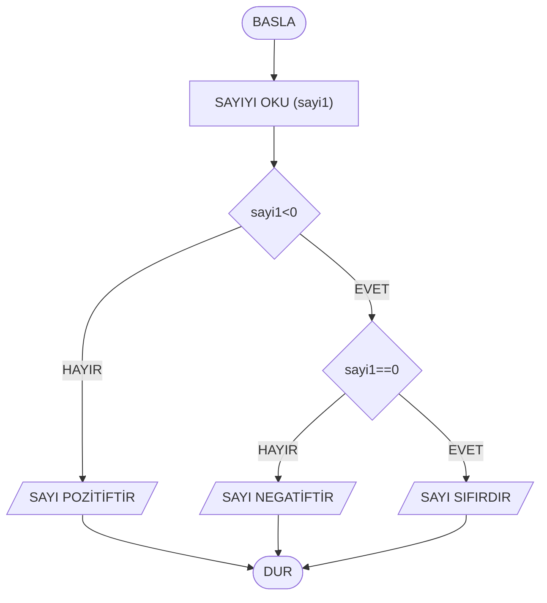

Proje Yazarı: Çiğdem BULUT ŞENOL
# Projenin Adı: Kod-Asistan v0.1
## Projenin Amacı: Kullanıcılara günlük işlerinde (hesaplama, selamlama vb.) yardımcı olacak bir dijital asistan tasarlamak
## Projenin Hedefleri: Bu asistanın ilerleyen zamanlarda hangi özellikleri kazanacağını (örneğin v1.0 Akıllı Menü, v2.0 Veri Saklama) maddeler hâlinde yazınız.

# kod_asistanim projesi
## alt başlığım
Bu benim ilk **readme** dosya içeriğim
1. İçerik1
    - Alt İçerik1
        - İçerikk1
        - İçerikk2
    - Alt İçerik1 
2. İçerik2
3. İçerik3

| Başlık1 | Başlık2 | Başlık3 | Başlık4 |
| ------- | ------- | ------- | ------- |

 
 

 
 
 
| Başlık 1 | Başlık 2 | Başlık 3 |
| -------- | -------- | -------- |
| Satır 1  | Veri A   | Veri B   |
| Satır 2  | Veri C   | Veri D   |

## Kaynakça
Meb Ders Kitabı
